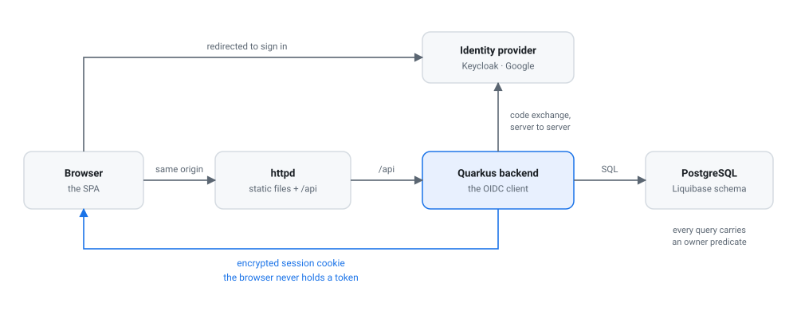
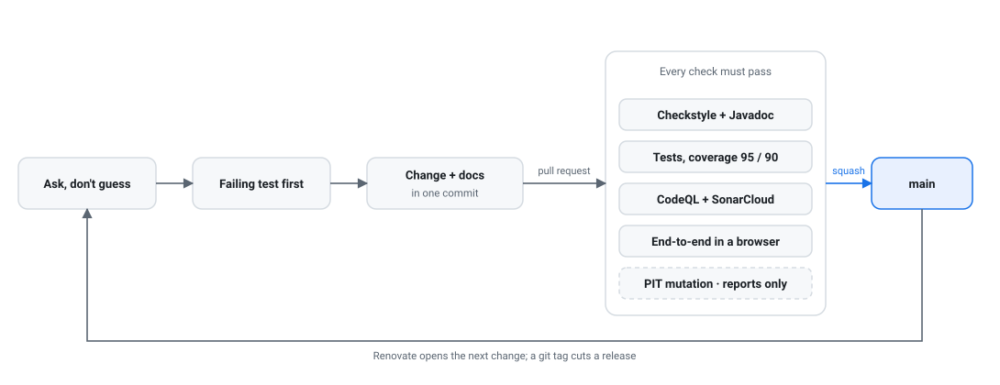

<p align="center">
  <a href="https://guhilling.github.io/ai-assisted-todolist/">
    <picture>
      <source media="(prefers-color-scheme: dark)" srcset="doc/images/logo-dark.svg">
      
    </picture>
  </a>
</p>

# TaskFest

[](https://github.com/guhilling/ai-assisted-todolist/actions/workflows/backend-ci.yml)
[](https://github.com/guhilling/ai-assisted-todolist/actions/workflows/frontend-ci.yml)
[](https://github.com/guhilling/ai-assisted-todolist/actions/workflows/codeql.yml)
[](https://sonarcloud.io/summary/new_code?id=guhilling_ai-assisted-todolist)

TaskFest is a browser-based task list: tasks with due dates, importance and workflow state,
private to whoever signed in. Quarkus backend, React + TypeScript frontend, PostgreSQL persistence,
OpenID Connect sign-in.

📖 **[The documentation and the API reference are published at
guhilling.github.io/ai-assisted-todolist](https://guhilling.github.io/ai-assisted-todolist/)** —
everything under `doc/` rendered, plus the OpenAPI contract for `main` and for every release.

The todo list is not really the point — this repository exists to build up experience with
AI-assisted software development. See [doc/purpose.md](doc/purpose.md). That is also why the
repository keeps its original name, `ai-assisted-todolist`, for historical reasons: it names the
experiment, and the application inside it is TaskFest.

## How the application fits together

<picture>
  <source media="(prefers-color-scheme: dark)" srcset="doc/images/architecture-dark.svg">
  
</picture>

The backend is a *backend-for-frontend*: it is the OIDC client, it performs the code
exchange itself, and what reaches the browser is an encrypted session cookie rather than a
token. One origin for the app and its API, so the SPA needs no API base URL. The one cross-origin
path is a file attached to a task: the browser uploads and downloads it straight to and from S3,
through links the backend signs, which is what the bucket's CORS rule is for.
[architecture.md](doc/architecture.md) has the deployment shape and
[authentication.md](doc/authentication.md) the sign-in flow in full.

## How a change reaches main

<picture>
  <source media="(prefers-color-scheme: dark)" srcset="doc/images/workflow-dark.svg">
  
</picture>

Anything that can be checked by a machine is, so that a convention does not depend on
somebody remembering it. The one deliberate exception is mutation testing, which reports
rather than blocks — [the testing chapter](doc/testing/mutation-testing.md) says why, and
[the decisions](doc/decisions/index.md) record that and every other choice with its reasoning.

Both diagrams are generated: edit `doc/images/generate.py` and re-run it rather than
touching the SVGs, which exist in a light and a dark variant that must stay in step.

## Getting it running

```bash
cd backend && ./mvnw quarkus:dev      # starts PostgreSQL and Keycloak for you
cd frontend && npm install && npm run dev
```

Open `http://localhost:5173` and sign in as `gunnar` / `gunnar`. Nothing else to install
and no credentials to obtain — [doc/local-development/](doc/local-development/index.md) has the
details, the second local account, the container stacks and the troubleshooting.

## Documentation

`doc/` is the source of truth; this page is the entry point. Each page answers one
question, so start from the question rather than the filename.

**Understanding it**

| | |
| --- | --- |
| [purpose.md](doc/purpose.md) | *Why does this repository exist, and why is it built the way it is?* |
| [architecture.md](doc/architecture.md) | *What are the pieces, how does a request travel, how is it deployed?* |
| [domain-model.md](doc/domain-model.md) | *What is a Task, and where is each invariant enforced?* |
| [authentication.md](doc/authentication.md) | *How does sign-in work, and why is the backend the OIDC client?* |

**Working on it**

| | |
| --- | --- |
| [local-development/](doc/local-development/index.md) | *How do I run it, and what do I do when it misbehaves?* |
| [testing/](doc/testing/index.md) | *What is tested where, and which checks can fail my build?* |
| [deployment/](doc/deployment/index.md) | *Where will this run on AWS, who may change it, and what does it cost?* |
| [releasing.md](doc/releasing.md) | *How do I cut a release, and what does it publish?* |
| [decisions/](doc/decisions/index.md) | *Why is it like this — and what was tried and rejected?* |

`decisions/` is the one worth reading before changing anything structural: several
settings in this repository look removable and are not, and it says which and why.

Code-level documentation lives in the code, as Javadoc and TSDoc. The conventions are in
[backend/CLAUDE.md](backend/CLAUDE.md) and [frontend/CLAUDE.md](frontend/CLAUDE.md), and
the backend build enforces them.

## Repository layout

- `backend/` — Quarkus REST API, published as `quay.io/ghilling/taskfest-backend`
- `frontend/` — React + TypeScript SPA, published as `quay.io/ghilling/taskfest-frontend`
- `e2e/` — Playwright browser tests driving the whole stack through a real sign-in
- `keycloak/` — realm export with the local test accounts, shared by Dev Services and CI
- `deployment/` — everything that deploys the app: `docker/` for the Compose stacks,
  `aws-tofu/` for the AWS infrastructure as OpenTofu
- `doc/` — project documentation, including `doc/api/`: the generated wire contract
- `.github/workflows/` — CI for backend, frontend, end-to-end, SonarCloud and publication

## API

All endpoints require a session except `/api/auth/providers`.

| Method | Path | |
| --- | --- | --- |
| `GET` | `/api/tasks` | the caller's tasks, by due date, then importance (high first) |
| `POST` | `/api/tasks` | create |
| `PUT` | `/api/tasks/{id}` | replace |
| `DELETE` | `/api/tasks/{id}` | delete |
| `GET` | `/api/auth/providers` | sign-in options |
| `GET` | `/api/auth/login` `/logout` `/me` | session |

A task has a description, a due date, an importance (`LOW`, `MEDIUM`, `HIGH`) and a state
(`TODO`, `WORKING`, `DONE`). OpenAPI is at `/q/openapi`, Swagger UI at `/q/swagger-ui`,
Prometheus metrics at `/q/metrics`.

The contract is **published**, not only served:
[**the API reference**](https://guhilling.github.io/ai-assisted-todolist/) has `/api/main/` for
the current code and `/api/v1.2.3/` per release, each with the OpenAPI 3.1 document and one
JSON Schema per type. The same files are committed under [`doc/api/`](doc/api/) and attached to
every release. They are generated and CI fails if the committed copy has drifted.

## CI/CD

- `backend-ci.yml` — backend tests, JVM packaging, container image build
- `frontend-ci.yml` — install, lint, build, frontend image build
- `e2e.yml` — builds both images, starts the full stack, runs the Playwright suite
- `sonarcloud.yml` — on `main` only: both test suites with coverage, the Sonar scan, and the quality gate, a failure of which opens a GitHub issue
- `publish-images.yml` — publishes both images to Quay as `latest` from `main`
- `codeql.yml` — CodeQL security scanning for Java and TypeScript, plus a weekly run
- `release.yml` — on a `v*` tag: release checks, versioned images, a GitHub Release

Image publication needs these repository secrets:

- `QUAY_ROBOT_USER` (preferred) or `QUAY_USERNAME`
- `QUAY_ROBOT_PASSWORD` / `QUAY_ROBOT_TOKEN` (preferred) or `QUAY_PASSWORD`

Production Google credentials are supplied through environment variables and never checked
in; `.env.example` lists them.

## Releases

```bash
git tag v1.0.0 && git push origin v1.0.0
```

That is the whole procedure. No version is written down anywhere else: the backend's
`pom.xml` carries `${revision}`, which the release build overrides from the tag, and the
frontend package is private and never published. `release.yml` then refuses SNAPSHOT and
pre-release dependencies, runs both suites, publishes `quay.io/ghilling/taskfest-backend:1.0.0`
and `taskfest-frontend:1.0.0`, and opens a GitHub Release. Details, including why `latest` is
not moved, are in [doc/releasing.md](doc/releasing.md).

## Dependencies

Renovate opens the update pull requests, configured in `.github/renovate.json`. Patch and
minor updates merge themselves once every check on the pull request is green; major updates
wait for a human. The dependency dashboard issue lists everything outstanding.

## License

Apache License 2.0 — see [LICENSE](LICENSE).

Copyright 2026 Gunnar Hilling.
